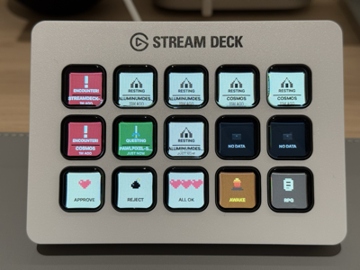
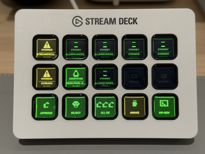
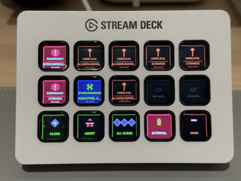
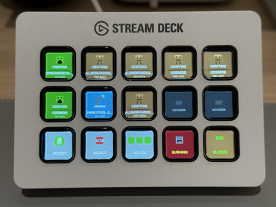
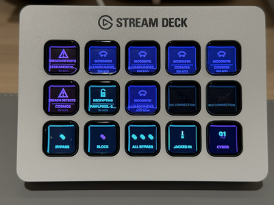

# Claude Sessions Stream Deck Plugin

Stream Deck MK2 plugin that shows active Claude Code sessions in real-time, with approve/reject/interrupt controls and one-tap terminal focus.

**[Product Page](https://claude-sessions.pawlpixel.net)** · **[Pawl & Pixel Studio](https://pawlpixel.net)**


## Features

- Session status display (`working` / `idle` / `permission`) with project name and time
- Short press to focus the corresponding Ghostty terminal tab
- Long press (>1s) to remove a stale session
- Approve / Reject / Interrupt / Approve All buttons for permission requests
- Caffeinate toggle (prevent system sleep during long sessions)
- Multiple visual themes (Skin Toggle)

## Skins

5 pixel-art skins, each with a unique aesthetic:

| RPG | Pip-Boy | MAGI | Blocks | Cyber |
|-----|---------|------|--------|-------|
|  |  |  |  |  |

## Demo

> See the full demo video at [`intro/Usage.mov`](intro/Usage.mov) or on the [product page](https://claude-sessions.pawlpixel.net).

## Requirements

- macOS 10.15+
- Stream Deck MK2 with Stream Deck software 6.5+
- Node.js 20+
- Python 3 (ships with macOS)
- [Ghostty](https://ghostty.org/) terminal (for tab focus)
- `@elgato/cli`: `npm install -g @elgato/cli`

## Quick Start

```bash
git clone <repo-url> && cd streamdeck
./install.sh
```

The install script will:
1. Copy hook scripts to `~/.claude/hooks/streamdeck/`
2. Register hooks in `~/.claude/settings.json` (non-destructive merge)
3. Install dependencies and build the plugin
4. Link and enable developer mode for Stream Deck

After install:
```bash
streamdeck restart com.chris.claude-sessions
```

Then add buttons to your Stream Deck layout in the Stream Deck app.

## Manual Setup

If you prefer to set things up step by step:

### 1. Install hooks

```bash
mkdir -p ~/.claude/hooks/streamdeck/pending ~/.claude/hooks/streamdeck/responses
cp hooks/hook.sh hooks/permission-gate.sh ~/.claude/hooks/streamdeck/
chmod +x ~/.claude/hooks/streamdeck/*.sh
```

### 2. Register hooks in Claude Code

Add the following to `~/.claude/settings.json` under `"hooks"`:

```json
{
  "hooks": {
    "SessionStart":      [{ "matcher": "", "hooks": [{ "type": "command", "command": "~/.claude/hooks/streamdeck/hook.sh", "timeout": 10 }] }],
    "UserPromptSubmit":  [{ "matcher": "", "hooks": [{ "type": "command", "command": "~/.claude/hooks/streamdeck/hook.sh", "timeout": 10 }] }],
    "Stop":              [{ "matcher": "", "hooks": [{ "type": "command", "command": "~/.claude/hooks/streamdeck/hook.sh", "timeout": 10 }] }],
    "Notification":      [{ "matcher": "", "hooks": [{ "type": "command", "command": "~/.claude/hooks/streamdeck/hook.sh", "timeout": 10 }] }],
    "PermissionRequest": [{ "matcher": "", "hooks": [
      { "type": "command", "command": "~/.claude/hooks/streamdeck/hook.sh", "timeout": 10 },
      { "type": "command", "command": "~/.claude/hooks/streamdeck/permission-gate.sh", "timeout": 130 }
    ] }],
    "SessionEnd":        [{ "matcher": "", "hooks": [{ "type": "command", "command": "~/.claude/hooks/streamdeck/hook.sh", "timeout": 10 }] }]
  }
}
```

### 3. Build and link

```bash
npm install
npm run build
streamdeck dev
streamdeck link com.chris.claude-sessions.sdPlugin
streamdeck restart com.chris.claude-sessions
```

## Stream Deck Buttons

| Button | Action |
|--------|--------|
| **Claude Session** | Shows session status. Short press = focus terminal. Long press = delete session. |
| **Approve** | Approve the oldest pending permission request |
| **Reject** | Reject the oldest pending permission request |
| **Interrupt** | Send Ctrl+C to the oldest working/permission session |
| **Approve All** | Approve all pending permission requests sequentially |
| **Caffeinate** | Toggle `caffeinate` to prevent system sleep |
| **Skin Toggle** | Cycle through visual themes |

## Architecture

Two processes communicate via files on disk:

```
Claude Code hooks (bash + python3)
  hook.sh          -> writes ~/.claude/hooks/streamdeck/sessions.json
  permission-gate.sh -> writes pending/{sid}.json, polls responses/{sid}.json

Stream Deck plugin (Node.js)
  reads sessions.json
  reads pending/*.json
  writes responses/*.json
```

- **sessions.json**: source of truth for session status (atomic writes via fcntl.flock)
- **pending/ + responses/**: file-based IPC for permission gate (blocking hook)

## Development

```bash
npm run build                                    # build plugin
streamdeck restart com.chris.claude-sessions     # reload (required after every build)
npm run watch                                    # watch mode
```

Plugin logs: `com.chris.claude-sessions.sdPlugin/logs/*.log`
Hook debug log: `~/.claude/hooks/streamdeck/debug.log`

## Troubleshooting

- **Buttons show "No Session"** — Check `~/.claude/hooks/streamdeck/sessions.json` exists and has data
- **Build changes not taking effect** — Run `streamdeck restart com.chris.claude-sessions` (requires dev mode: `streamdeck dev`)
- **Approve button stuck** — Check for stale files: `ls ~/.claude/hooks/streamdeck/pending/ ~/.claude/hooks/streamdeck/responses/`
- **Terminal focus fails** — Ensure Ghostty is running and macOS Accessibility permissions are granted for Stream Deck
